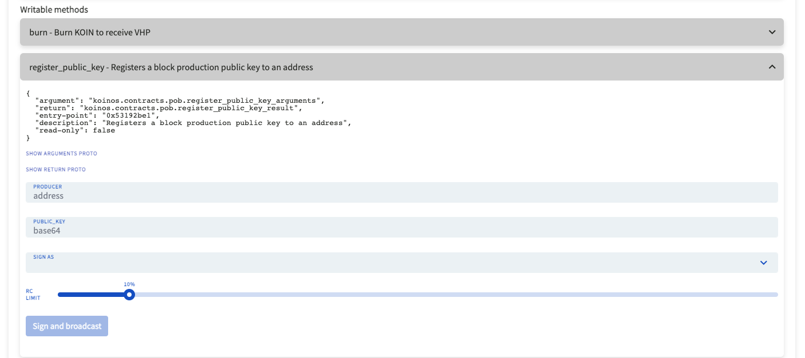

# Step 4: Final Setup

## Mac and Linux

Once the node is shut down, go back to your base directory and find the node database files located in the hidden folder named `/.koinos`. 

Enter the hidden folder using the following command:
```
cd ./koinos
```
Once you are in the directory with the node files, navigate to the `block_producer` directory with the following command

```
cd block_producer
```

In this folder, you will find two files, one called `private.key` and `public.key`.
Open public.key with you editor to copy the public key, in this case, we will use `nano` again.
```
nano public.key
```
Copy your public key value for the next step. This piece of information is not sensitive, but keep it secure. Sharing this key will not compromise your tokens.


## Windows
Once the node is shut down, go back to your base directory, for windows users, this would be in the `c:\koinos-node` directory. 

Enter the folder and navigate to the `block_producer` directory where you will find two files, one called `private.key` and `public.key`.
Open public.key with your prefered editor and copy your public key value. This piece of information is not sensitive, but keep it secure. Sharing this key will not compromise your tokens.

#

# Registering your Mining Node 
This step is the same for Windows, Mac or Linux.

You must associate the public key of your newly launched Koinos mining node with the public key of the wallet containing your $KOIN. This step ensures that your node machine doesnt share the same private key as your $KOIN.

You will need access to your wallet via Kondor Wallet or your Private Key if using `koinos-cli`. 

Go to [Koinos Blocks](http://koinosblocks.com) and at the top  of the page, click `contracts`, then click `pob Proof of Burn consensus algorithm` with the address `159myq5YUhhoVWu3wsHKHiJYKPKGUrGiyv`, or [click here for a direct link](https://koinosblocks.com/address/159myq5YUhhoVWu3wsHKHiJYKPKGUrGiyv)

Click on the `Connect Kondor` at the top right corner, and follow the on screen prompts to connect Kondor Wallet to Koinos Blocks. Connect KoinosBlocks to the wallet which contains the $KOIN that you are prepared to burn (burning $KOIN is required to participate in Block Production).


Under `writeable methods` click on `register_public_key` and fill in the requested information.


```
`PRODUCER` is the address of your Kondor Wallet that is connected.
`PUBLIC KEY` is the information contained in the public.key file that you retrieved earlier.
`SIGN AS` is the address of your Kondor Wallet that is connected.
 ```
Once that information is filled, clicked `Sign and broadcast` and follow the prompts provided by Kondor. After this step, your Mining Node is now associated with your $KOIN wallet.


### Burning your $KOIN to receive $VHP
Before you can begin mining, you must burn $KOIN to get $VHP. $VHP is a consumable "fuel" that is requried to operate your miner. As you mine, you return $VHP back to the network and gain it back $KOIN as a reward in return. When you run out of $VHP, you must replenish your $VHP supply by burning $KOIN again. There are no restrictions to when you can reburn your $KOIN.

By running a mining node, you will always earn more $KOIN than you burned. To burn your $KOIN,

Go to [Koinos Blocks](http://koinosblocks.com) and at the top  of the page, click `contracts`, then click `pob Proof of Burn consensus algorithm` with the address `159myq5YUhhoVWu3wsHKHiJYKPKGUrGiyv`. This is the same link you used to register your node.

Click on `Writeable Methods` again, and click `burn - Burn KOIN to receive VHP`and fill in the requested information.


```
`TOKEN AMOUNT` is how much $KOIN you wish to burn.
`BURN_ADDRESS` is address of the connected Kondor wallet.
`VHP_Address` is address of the connected Kondor wallet.
`SIGN AS` is address of the connected Kondor wallet.
```
Once that information is filled, clicked `Sign and send` and follow the prompts provided by Kondor.

# STEP 4: Re-start the node!

With everything setup, we can now start the node by navigating back to `/koinos` (or `C:\koinos-2.0.0` for Windows) and use the `docker compose --profile all -d` command to start the node again.


Your node will quickly catch back up to the current block height and once synced again, it will begin to attempt to produce blocks until a successful block is created. 

To check if your node is attempting to produce blocks check the `block_producer` logs with the following command:
```
docker logs koinos-block_producer-1 -n 100
```

You'll get the following response:

```
2023-06-11 14:19:04.072948 (block_producer.Koinos) [pob_producer.cpp:395] <info>: Estimated total VHP producing: 12857586.11075839 VHP
2023-06-11 14:19:04.073100 (block_producer.Koinos) [pob_producer.cpp:398] <info>: Producing with 100.00000000 VHP
```

If your node produced a block, you'll get the following log:

```
2023-06-11 14:17:51.219810 (block_producer.Koinos) [block_producer.cpp:300] <info>: Produced block - Height: 6094107, ID: 0x122031250ebc494a3138dce0cbc64e690564343bcf9bf502679d6d0cb1d7ff32b1b6 (0 transactions)
```


Thats it! Your node is online! Congratulations!