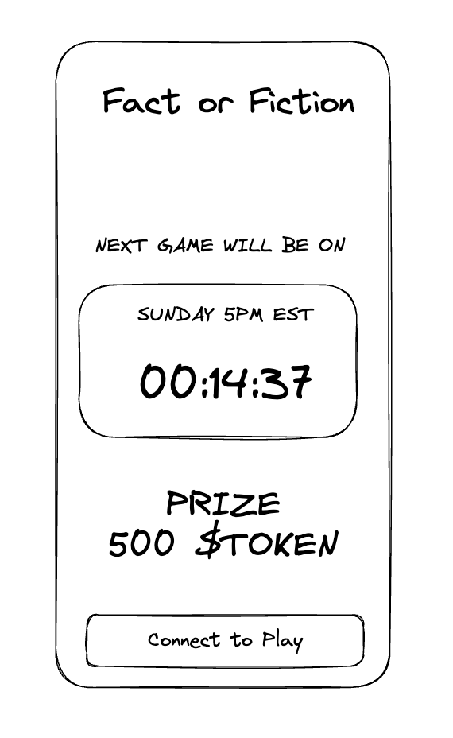
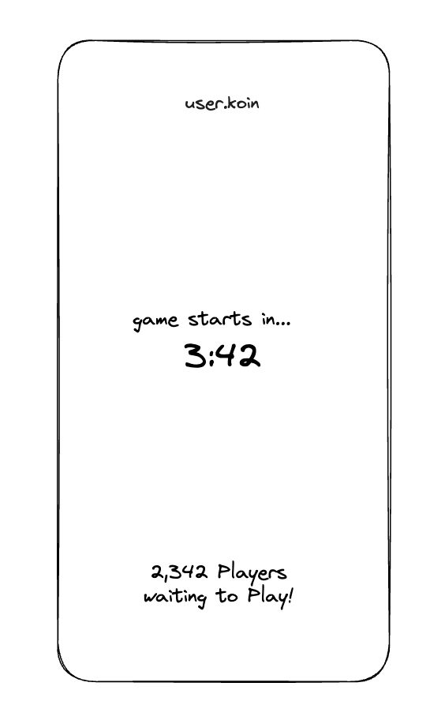
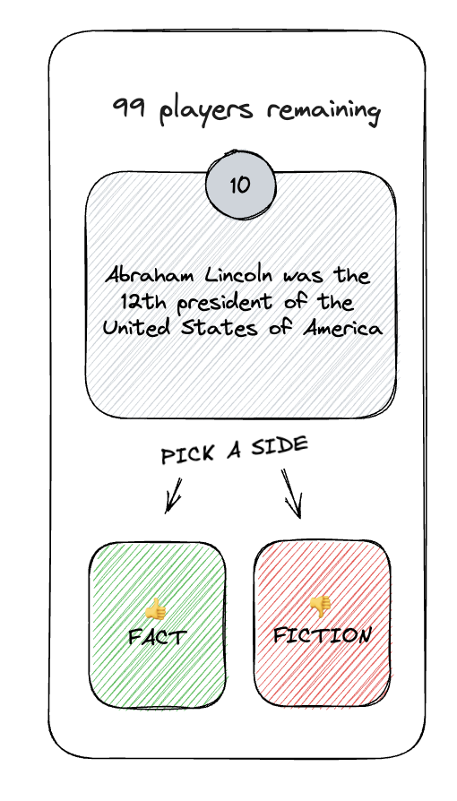
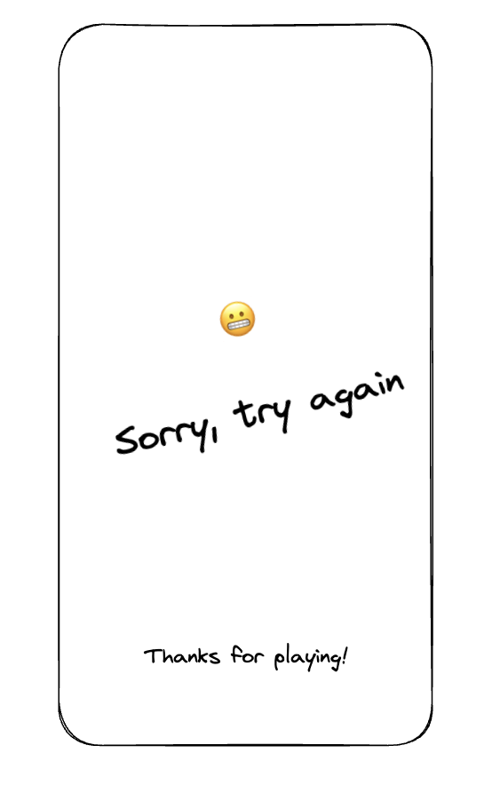
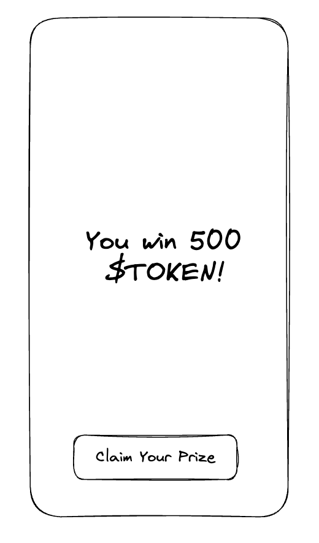

# Building the Front End

## Purpose of the Front End

main reason: The thing users interface with, without it, the dApp cant reach users.
Scecondary reason: Branding
Third Reason: Quality

Doesnt matter what framework you choose to build the front end, just be proficient in it. We're using React because that was what our frontend developer was most familiar with and could build easily.

## Things to Avoid

Avoid spending too much time making it look polished. Nothing is worst than a great website with a shitty product.

Avoid too much information. If its too complicated that users cant figure it out intuitively, your MVP is too complicated.

Avoid trying to learn anything new if possible. If users know this is an MVP product, they will let it slide and focus on the ease of use.

## Things to Emulate

Copy an existing interface thats not unique to any specific application. Reduces development time if there are off the shelf items.

## Mocking up the Front End

We used excalidraw to mockup our front end quickly. We began with more pages then we needed and quickly wittled it down to something that was barebones. Here's the images of how each screen looks like and their function.

The user will often hear of something and click a link. Once they arrive,, they should immediately know if they can interact with the application. Since the game operates on specific cycles, our goal was to notify them of the next game so they can come back. 

Within 1 hour of the game starting, the room begins to populate with users in the waiting area and there is a count down timer that gives the user a definitive start time. Once the timer ends, the game immediately begins.

A question is displayed with two choices. Other bits of information include how many players are left and a count down timer starting from 10.

If the player selects the right answer, then they move onto the next question and the players remaining is updated.

If the player selects the wrong answer, then they immediately get disconnected and observe the remaining game.

The last player standing gets a unique winners window that gives them the reward. Once the game is over, the backend  to automatically updates the gamestats with the winner and their wallet address and when the winner clicks "Claim Your Prize" they'll collect the reward token.

