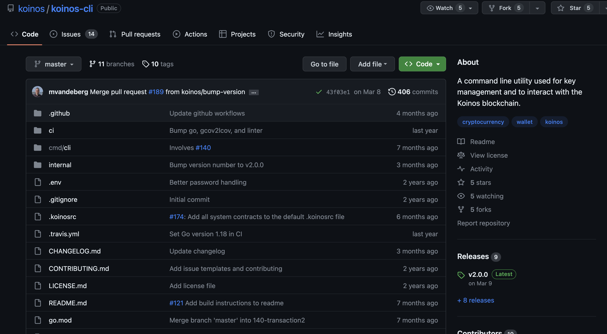

# Installing Koinos-CLI

[To download `koinos-cli` visit the github repo here](https://github.com/koinos/koinos-cli).

On the right side is a section called `Releases` where you will find the downloadable binarys to run the application. As of this writing, the current version is `v2.0.0`. 



Clicking on the version number will bring you to the download page where you can grab the binary for your specific operating system. Optionally, some users may want to view the source code and compile it on their own.


Once the binary for your machine is downloaded, open the compressed folder and extract the contents to your prefered location. __Within this folder is a hidden file called `.koinosrc`.__ 


If you don't see it, make sure your OS shows hidden files. Open `.koinosrc` in your preferred editor and you will see the following contents:

```
connect https://api.koinos.io/
register_token koin 15DJN4a8SgrbGhhGksSBASiSYjGnMU8dGL
register_token vhp 1AdzuXSpC6K9qtXdCBgD5NUpDNwHjMgrc9
register pob 159myq5YUhhoVWu3wsHKHiJYKPKGUrGiyv
register name_service 19WxDJ9Kcvx4VqQFkpwVmwVEy1hMuwXtQE
register claim 18zw3ZokdfHtudzaWAUnU4tUvKzKiJeN76
register resources 1HGN9h47CzoFwU2bQZwe6BYoX4TM6pXc4b
register governance 19qj51eTbSFJYU7ZagudkpxPgNSzPMfdPX
```

By default, the `.koinosrc` file automatically connects `koinos-cli` to the Koinos Main Net and loads up several smart contracts.

The `connect` command at the top connects you to the ___main net RPC node___ provided by Koinos Group. This is the official API and it is currently free. In the future you may decide to change API nodes, simply change the URL to change the RPC end point.

If you are working on ___The Harbinger Test Net___ you will need to point your wallet to test net nodes and testnet smart contracts. We suggest you replace the entire contents of your `.koinosrc` file with the following information:

```
connect https://harbinger-api.koinos.io/
register_token koin 1FaSvLjQJsCJKq5ybmGsMMQs8RQYyVv8ju
register_token vhp 17n12ktwN79sR6ia9DDgCfmw77EgpbTyBi
register pob 1MAbK5pYkhp9yHnfhYamC3tfSLmVRTDjd9
register resources 16X6cKyqiT8EzPEksRJxXcqMnHMMm9Vxct
register governance 17MjUXDCuTX1p9Kyqy48SQkkPfKScoggo
```

___💡 Pro tip: Create two folders for `koinos-cli`! One with a `.koinosrc` file specific for test net and another for main net!___

As you become more familiar with using `koinos-cli` you can modify the `.koinosrc` file to suit your needs by adding additional contracts that you use often. We'll go over each of these commands in this module.


## Starting the `koinos-cli` wallet.

### Windows Users:

Run the executable `koinos-cli.exe`

### Mac and Linus Users:

Open your terminal in the directory of your `koinos-cli` binary and run the following command:

```
./koinos-cli
```
The CLI will automatically use the `.koinosrc` file to connect to either test net or main net, then preload the listed smart contracts.

To see a list of commands that you can call, use the following command
```
list
``` 
The output should be something similar to below. Be aware, if you register additional contracts in the `.koinosrc` file or removed some, this list may appear differently: 

```
🔐 > list

account_rc                                - Get the current resource credits for a given address (open wallet if blank)
address                                   - Show the currently opened wallet's address
call                                      - Call a smart contract
chain_id                                  - Set chain id in base64 for transactions. 'auto' will default to querying for chain id. Blank id to view
close                                     - Close the currently open wallet (lock also works)
connect                                   - Connect to an RPC endpoint
create                                    - Create and open a new wallet file
disconnect                                - Disconnect from RPC endpoint
exit                                      - Exit the wallet (quit also works)
generate                                  - Generate and display a new private key
governance.get_proposal_by_id             - Retrieves proposals by ID
governance.get_proposals                  - Retrieves proposals
governance.get_proposals_by_status        - Retrieves proposals by status
governance.pre_block_callback             - An implement of pre_block, not to be called directly
governance.submit_proposal                - Submits a proposal
help                                      - Show help on a given command
import                                    - Import a WIF private key to a new wallet file
koin.balance_of                           - Checks the balance at an address
koin.total_supply                         - Checks the token total supply
koin.transfer                             - Transfers the token
list                                      - List available commands
nonce                                     - Set nonce for transactions. 'auto' will default to querying for nonce. Blank nonce to view
open                                      - Open a wallet file (unlock also works)
payer                                     - Set the payer address for transactions. 'me' will default to current wallet. Blank address to view
pob.burn                                  - Burn KOIN to receive VHP
pob.get_consensus_parameters              - Returns PoB consensus parameters
pob.get_metadata                          - Returns PoB metadata
pob.get_public_key                        - Gets the public key registered to a producer address
pob.register_public_key                   - Registers a block production public key to an address
pob.update_consensus_parameters           - Returns PoB consensus parameters
private                                   - Show the currently opened wallet's private key
public                                    - Show the currently opened wallet's public key
rclimit                                   - Set or show the current rc limit. Give no limit to see current value. Give limit as either mana or a percent (i.e. 80%).
read                                      - Read from a smart contract
register                                  - Register a smart contract's commands
register_token                            - Register a token's commands
resources.consume_block_resources         - Consumes block resources
resources.get_resource_limits             - Gets the resource limits
resources.get_resource_markets            - Gets the resource markets
resources.get_resource_parameters         - Gets the resource parameters
resources.set_resource_markets_parameters - Sets the resource markets parameters
resources.set_resource_parameters         - Sets the resource parameters
session                                   - Create or manage a transaction session (begin, submit, cancel, or view)
set_system_call                           - Set a system call to a new contract and entry point
set_system_contract                       - Change a contract's permission level between user and system
submit_transaction                        - Submit a transaction from base64 data
upload                                    - Upload a smart contract
vhp.balance_of                            - Checks the balance at an address
vhp.total_supply                          - Checks the token total supply
vhp.transfer                              - Transfers the token
```
 

You can also run `help` against any command to learn more about it. Notice that the command `help` always provides `Usage` instructions. 

```

🔐 > help create
Create and open a new wallet file
Usage: create <filename:file> [password:string]

```
In this case, to use the command `create`, you need two additional arguments, one is the name of the file that contains the wallet information, and the password to encrypt the wallet file.

Next, we'll create a new wallet.
