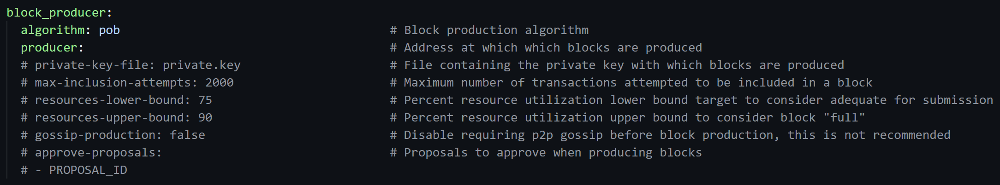

# Step 2: Environment Setup

Before we begin sycing with the blockchain, we'll need to setup the Koinos Node Environment.

##


# SETTING UP THE config.yml FILE

## Mac and Linux
Enter your `~./koinos` directory that you just cloned via github. Inside this directory is a folder called `config-example`.  Make a copy of this folder and rename it to `config`. If using command line, use the following command:

```
cp -r config-example config
```

Enter the `config` folder and open the `config.yml` file using your preferred editor. We will be using `nano` editor. If using command line, use the following command:
```
cd config
nano config.yml
```
This will open the file in your editor where you will need to edit several fields. Find the `#producer` field and remove the `#`. Then add the wallet address where you are holding your $KOIN or $VHP.
```
#producer:
```
to
```
producer: <insert wallet address here>
```
Your block_producer field should look like this, but with your wallet address inserted into the `producer` section. This image intentionally left  the `producer` filed blank.




## Windows Only
Enter the `C:\koinos-2.0.0` directory. Inside this directory is a folder called `config-example`.  Make a copy of this folder and rename it to `config`. 

Enter the `config` folder and open the `config.yml` file using your preferred editor. For windows, this can be notepad.

This will open the file in your editor where you will need to edit several fields. Find the `#producer` field and remove the `#`. Then add the wallet address where you are holding your $KOIN or $VHP.
```
#producer:
```
to
```
producer: <insert wallet address here>
```
Your block_producer field should look like this, but with your wallet address inserted into the `producer` section. This image intentionally left  the `producer` filed blank.


##

# SETTING UP THE .env FILE

## Mac and Linux
Inside your `~./koinos` directory, is a file called `env.example`.  Make a copy of this file and rename it to `.env`. If using command line, use the following command:

```
cp env.example .env
```

The `.env` file is used to manage the directory of your Koinos Node database files. The remainder of this guide assumes you use the default home directory. No further changes to this file is necessary.


## Windows Only
Inside your `C:/koinos-2.0.0` directory, is a file called `env.example`.  Make a copy of this file and rename it to `.env`. Open the file with your editor and change  the following:

```
BASEDIR=~./koinos
```
to
```
BASEDIR=c:\koinos-node
```
This will use `c:\koinos-node` directory for your koinos node database. You do not need to use the phrase `koinos-node` and may name it anything you like but the remainder of this guide will assume this as the default name.


