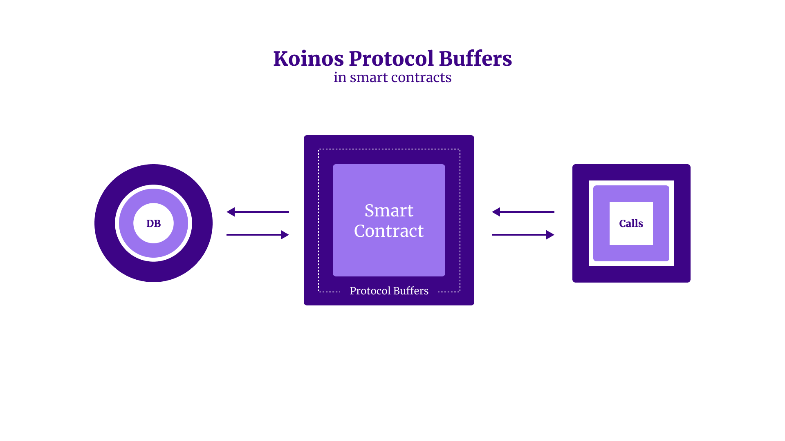

# Todo List Smart Contract Tutorial

In this tutorial we will create a smart contract that stores and retrieves todo items on the Koinos blockchain. Please note: this is only for demonstration it is not a practical application for a smart contract. This will help us understand how Protocol Buffers work as well as how to define and store state on the blockchain.

This is part 2 of a 4 part series on how to develop smart contracts on the Koinos blockchain. Part 1 on setting up the dev environment can be found [here](https://learnkoinos.xyz/docs/modules/M4/1_introduction.html).

**Understanding Protocol Buffers in Koinos Smart Contracts**

From Google:

> Protocol buffers are Google’s language-neutral, platform-neutral, extensible mechanism for serializing structured data – think XML, but smaller, faster, and simpler. You define how you want your data to be structured once, then you can use special generated source code to easily write and read your structured data to and from a variety of data streams and using a variety of languages.

On Koinos, Protocol buffers help our smart contracts to communicate with the outside world. A function that has to interact with an api call or execute database read/write must first pipe the data structure through PB in order to facilitate seamless communication.



### Todo list

For this demonstration we will use a todo list as a way to learn how to create a smart contract that stores and retrieves data from the blockchain. This is not a practical decentralized application (dApp) but we will learn basic functionality that is necessary for smart contract development.

Let’s generate `todos` by running the command `koinos-sdk-as-cli create todos`

We can now cd into our new `todos` directory and install the necessary dependencies by running `yarn`

Just to be sure everything is working correctly let’s build the contract and run the `test` command.

`yarn build:debug`

`yarn test`

**Goal:**

Create a smart contract that accepts a todo item, writes it to the blockchain and then be able to read a list of all todos from the blockchain.

We will need two functions:

1. Add a todo and store it in chain state
2. Get all of the todos from chain state

The first thing we will need to do is to define the data in the `todos.proto` file.

`todos.proto`

```jsx
syntax = "proto3";

package todos;

// @description Add todo to the todo list
// @read-only false
message add_todo_arguments {
  string task = 1;
}

message add_todo_result {}

// @description Returns the list of todos
// @read-only true
message get_todos_arguments {}

message get_todos_result {
  repeated string value = 1;
}

// @description The object keeing track of todos in chain state
message todo_object {
  repeated string tasks = 1;
}
```

Once we define our proto file we can generate the boilerplate code by running the command: `yarn build:debug`

We will see the following error:

```jsx
ERROR TS2339: Property 'add_todo' does not exist on type 'assembly/Todos/Todos'.

       const res = c.add_todo(args);

....
```

This is expected behavior as we have not yet written our Todos.ts file

Open `Todos.boilerplate.ts` we will need to copy the code here and paste it into our Todos.ts file. Here we will write out our functions to write a todo to the chain and then retrieve the todos from the chain.

But first, let’s create the state files and add a storage constructor.

In the `assembly` directory of our project let’s create a directory called `state`

Here we will add two files `SpaceIds.ts` and `TodoStorage.ts`

`./state/SpaceIds.ts`

```jsx
export const TODOS_SPACE_ID = 0
```

Here we define the id of the space for our storage.

SpaceIds are a convenient way to identify different tables within our database array. This helps us during data retrieval because we can easily expect the type of data stored in each table. The `SpaceId.ts` file should have at a minimum the first line shown above, however we may use as many Space IDs as we need for our project. The numbered values represent the id of the storage space and can be any value we wish.

`./assembly/state/TodoStorage.ts`

```jsx
import { Storage } from "@koinos/sdk-as"
import { todos } from "../proto/todos"
import { TODOS_SPACE_ID } from "./SpaceIds"

export class TodoStorage extends Storage.Obj<todos.todo_object> {
  constructor(contractId: Uint8Array) {
    super(
      contractId,
      TODOS_SPACE_ID,
      todos.todo_object.decode,
      todos.todo_object.encode,
      () => new todos.todo_object()
    )
  }
}
```

Here we are creating a constructor to define the encoding and decoding of the todos object.

We can now move on to the Todos.ts file and add our functions.

`./assembly/Todos.ts`

```jsx
import { System, authority } from "@koinos/sdk-as";
import { todos } from "./proto/todos";
import { TodoStorage } from "./state/TodoStorage";

export class Todos {
  // Gets the contract ID from the system and stores it in a private variable
  _contractId: Uint8Array = System.getContractId();
  // Creates a new instance of the TodoStorage class
  _todoStorage: TodoStorage = new TodoStorage(this._contractId);

  // Adds a todo and stores it to chain state
  // Since this is a write operation, it must be called within a transaction
  add_todo(args: todos.add_todo_arguments): todos.add_todo_result {

    // retrieves the todo object from chain state
    let todosObj = this._todoStorage.get();

    // if the todo object does not exist, create a new one
    if (!todosObj) {
      todosObj = new todos.todo_object();
    }

    // add the new task to the todo object
    todosObj.tasks.push(args.task!);

    // store the todo object to chain state
    this._todoStorage.put(todosObj);

    // create an empty result because we don't need to return anything
    return new todos.add_todo_result();

  }

  // Gets all todos from chain state
  // Because this is a read operation, it does not need to be called within a transaction
  get_todos(args: todos.get_todos_arguments): todos.get_todos_result {
    // retrieves the todo object from chain state
    let todosObj = this._todoStorage.get();

    // if the todo object does not exist, create a new one
    if (!todosObj) {
      todosObj = new todos.todo_object();
    }

    // create a new result object and set the value to the tasks from the todo object
    const res = new todos.get_todos_result();

    // set the value of the result object to the tasks from the todo object
    res.value = todosObj.tasks;

    return res;
  }
}
```

We first import TodoStorage from our `TodoStorage.ts` file.

We then export a class called `Todos` which contains the two functions we will need in order to achieve our goal.

We first need to instantiate variables to hold the `contractId` from the system as well as the `TodoStorage` constructor from the state file we created earlier.

**First function: `add_todo`**

In the add to do function we first add the argument we defined in our proto file as well as the result.

```jsx
 add_todo(args: **todos.add_todo_arguments**): **todos.add_todo_result** {
	...
```

We then retrieves the todo object from chain state, if the todo object does not exist, create a new one. We can then add the new task to the todo object and finally store the todo object to chain state. We create an empty result because we don't need to return anything.

```jsx
    // retrieves the todo object from chain state
    let todosObj = this._todoStorage.get();

    // if the todo object does not exist, create a new one
    if (!todosObj) {
      todosObj = new todos.todo_object();
    }

    // add the new task to the todo object
    todosObj.tasks.push(args.task!);

    // store the todo object to chain state
    this._todoStorage.put(todosObj);

    // create an empty result because we don't need to return anything
    return new todos.add_todo_result();
```

**Second function: `get_todos`**

Because this is a read operation, it does not need to be called within a transaction. We first retrieve the todo object from chain state, if the todo object does not exist, we create a new one. We can then create a new result object and set the value to the tasks from the todo object. And finally set the value of the result object to the tasks from the todo object.

```jsx
  // Because this is a read operation, it does not need to be called within a transaction
  get_todos(args: todos.get_todos_arguments): todos.get_todos_result {
    // retrieves the todo object from chain state
    let todosObj = this._todoStorage.get();

    // if the todo object does not exist, create a new one
    if (!todosObj) {
      todosObj = new todos.todo_object();
    }

    // create a new result object and set the value to the tasks from the todo object
    const res = new todos.get_todos_result();

    // set the value of the result object to the tasks from the todo object
    res.value = todosObj.tasks;

    return res;
  }
```

We are now ready to build our contract by running the command `yarn build:release`

If there are no errors we can upload the `contract.wasm` file and `todos.abi` to the Koinos testnet.

Let’s fire up our Koinos CLI and open the testnet wallet, remember that we need to have some tKOIN in order to upload the contract. (if you haven’t set one up yet, take a look at this tutorial [https://learnkoinos.xyz/docs/modules/M1/1_introduction.html](https://learnkoinos.xyz/docs/modules/M1/1_introduction.html))

Once we have the wallet open we can issue the following command:

`upload todos/build/release/contract.wasm todos/abi/todos.abi`

The result should look something like this:

```jsx
Contract uploaded with address 1GB8ZYZNvz6efGRKdiCYtk23Pk6yLREZCu
Transaction with ID 0x122033a6fe5457fc1f3f8287943924909290f51be09e270187c0552dadf44b78d630 containing 1 operations submitted.
Mana cost: 0.30183113 (Disk: 3955, Network: 19687, Compute: 350618)
```

Our contract is now live on the Koinos network.

Let’s test it out!

We first need to register the contract by issuing the command `register todos 1GB8ZYZNvz6efGRKdiCYtk23Pk6yLREZCu`

Now we have access to the functions in the contract. Let’s add a todo item to the list.

`todo.add_todo "Write a todo list smart contract"`

The response should look something like this:

```jsx
Calling todos.add_todo with arguments 'task: "Write a todo list smart contract"
'
Transaction with ID 0x12201c928be40d6bbd221a487fd9cd6af900172447e7378b40b29ea8927684388689 containing 1 operations submitted.
Mana cost: 0.01771484 (Disk: 50, Network: 274, Compute: 347897)
```

We can now call the `todos.get_todos` function which should return the following:

```jsx
value: "Write a todo list smart contract"
```

**Conclusion**

We were able to successfully write a smart contract that can write data to the blockchain as well as retrieve that data. In the process we learned how to use Protocol Buffers on the Koinos blockchain as well as how to define our state and storage space.

In the next installment we will create a simple front end that can communicate with our todos smart contract so we can write and read date from a web page.
