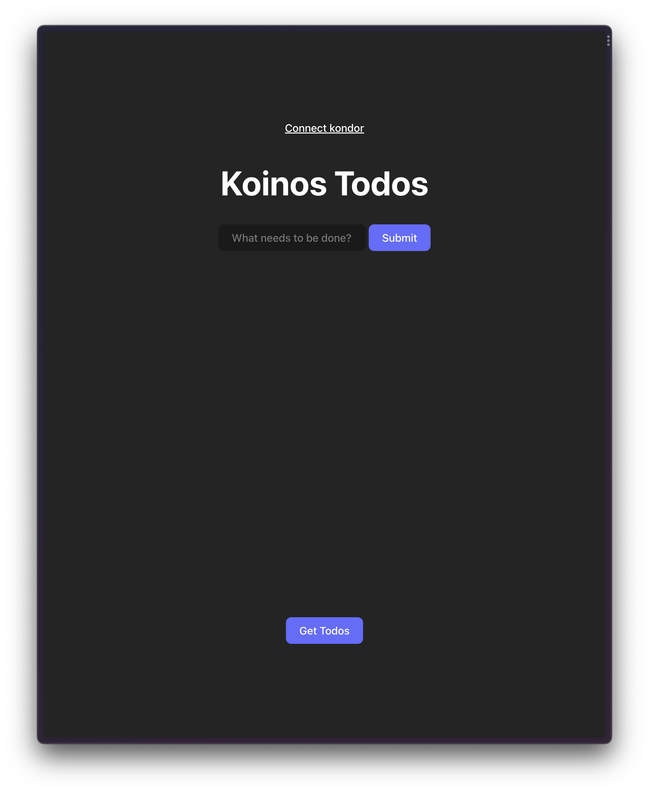
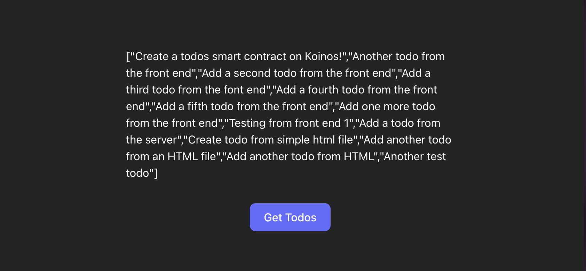
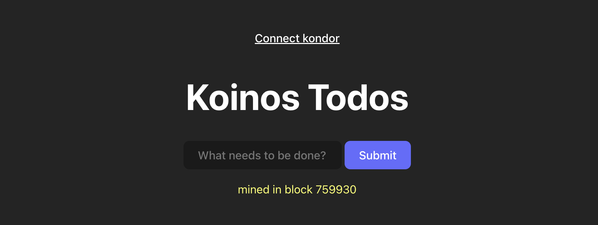

# Todo List Front End

In this tutorial we will build on our previous tutorial in which we created a todo list smart contract. Our goal is to build a front end that can be deployed to a web server to allow users to interact with our smart contract through a GUI.

This is part 3 of a 4 part series on how to develop smart contracts on the Koinos blockchain.

- Part 1 on setting up the dev environment can be found [here](https://learnkoinos.xyz/docs/modules/M4/1_introduction.html).
- Part 2 on building the smart contract can be found [here](https://learnkoinos.xyz/docs/modules/M8/1_todos.html).

We will use HTML, CSS and vanilla JS but you can use Vue, React, Svelte etc. It’s also possible to connect to the smart contract using Swift or Kotlin on mobile. In this tutorial we are using the Kondor wallet Chrome extension, we can also use [WalletConnect](https://www.npmjs.com/package/@armana/walletconnect-koinos-sdk-js) but that is out of the scope of this exercise. We will need a test account in Kondor with some tKoin.

The code can be found here [https://github.com/koinos/todos-front-end](https://github.com/koinos/todos-front-end)

We will only need two files plus the libraries to make this work and the second one is optional. If we wanted to we could contain the entire app in one HTML file.

Files:

`index.html`

`style.js`

Dependencies:

`kondor.js`

`koinos.js`

We first need to create the basic HTML structure. These are the elements we will need:

- A button to connect to Kondor
- An input to enter the todo
- A button to submit the todo to the blockchain (execute the `addTodo` function)
- A div to hold the response from the blockchain
- A button to retrieve the current list of todos from the blockchain (execute the `getTodos` function)
- A div to display the payload returned from the blockchain

Here is an image of the finished product



Basic HTML code:

```html
<div id="app">
  <header>
    <button
      id="getAccounts"
      class="secondary-button"
    >
      Connect kondor
    </button>
    <h1>Koinos Todos</h1>
    <input
      type="text"
      placeholder="What needs to be done?"
      id="newTodo"
    />
    <button id="addTodo">Submit</button>
    <div id="minde-block"></div>
  </header>
  <div class="loader-container">
    <span
      id="loader"
      class="loader invisible"
    ></span>
  </div>
  <div class="card">
    <div
      class="results"
      id="display-results"
    ></div>
    <button id="getTodos">Get Todos</button>
  </div>
</div>
```

The CSS code is at the end of this tutorial, the styling is completely optional.

Next we will need to add the libraries necessary to make the connection to our smart contract:`kondor.js` and `koinos.js`

```html
<script src="js/kondor.js"></script>
<script src="js/koinos.js"></script>
```

### Kondor Wallet

The `kondor.js` library allows us to interact with the Kondor wallet. We will use the Kondor wallet to pay the Mana necessary to execute transactions on the blockchain. You can install the Kondor Chrome extension [here](https://chrome.google.com/webstore/detail/kondor/ghipkefkpgkladckmlmdnadmcchefhjl).

Let’s dive into the JavaScript code. To make things super simple we will put the JS directly into our HTML file right before the closing `</body>` tag.

```jsx
<script type="module">
        // declare contract and accounts variables
        let todosContract;
        let accounts;

        // Connect to kondor
        async function connectKondor() {
            console.log("Connecting kondor...")
            accounts = await kondor.getAccounts();
            console.log("Kondor connected");
            console.log(accounts);
        }

        // Get the contract from the blockchain
        async function getContract() {
            if (todosContract) return todosContract;
            if (!accounts) await connectKondor();
            const provider = new Provider(["https://harbinger-api.koinos.io"]);
            const userAddress = accounts[0].address;
            const todosContractAddress = "1BKnB35ow1rhJ5WJUmYTBdkfSTBPbyqrQg";

            todosContract = new Contract({
                id: todosContractAddress,
                provider,
                signer: kondor.getSigner(userAddress),
            });

            // get the abi of todosContract
            await todosContract.fetchAbi();

            // update abi to be compatible with koilib
            todosContract.abi.methods.add_todo.entry_point = Number(todosContract.abi.methods.add_todo["entry-point"]);
            todosContract.abi.methods.add_todo.read_only = todosContract.abi.methods.add_todo["read-only"];
            todosContract.abi.methods.get_todos.entry_point = Number(todosContract.abi.methods.get_todos["entry-point"]);
            todosContract.abi.methods.get_todos.read_only = todosContract.abi.methods.get_todos["read-only"];

            return todosContract;
        }

        // Get the list of todos from the blockchain
        async function getTodos() {
            const contract = await getContract();
            const { result } = await contract.functions.get_todos();
            document.getElementById("display-results").innerHTML = JSON.stringify(result.value);
        }

        // Call the add_todo function on the contract
        async function addTodo() {
            const { value: task } = document.getElementById("newTodo");
            const contract = await getContract();
            const { transaction, receipt } = await contract.functions.add_todo({ task });
            console.log("submitted. Receipt:");
            console.log(receipt);

            // wait to be mined
            const { blockNumber } = await transaction.wait();
            console.log(`mined in block ${blockNumber}`);
            document.getElementById("minde-block").innerHTML = `mined in block ${blockNumber}`;
        }

        document.getElementById("getAccounts").addEventListener("click", connectKondor);
        document.getElementById("addTodo").addEventListener("click", addTodo);
        document.getElementById("getTodos").addEventListener("click", getTodos);
</script>
```

Let’s break down the code above.

We first declare the `todosContract` and `accounts` variables and then create an asynchronous function to connect to the Kondor wallet.

```jsx
// declare contract and accounts variables
let todosContract;
let accounts;

// Connect to kondor
async function connectKondor() {
  console.log("Connecting kondor...");
  accounts = await kondor.getAccounts();
  console.log("Kondor connected");
  console.log(accounts);
}
```

Next we create another asynchronous function which connects to our smart contract on the blockchain.

```jsx
// Get the contract from the blockchain
async function getContract() {
  if (todosContract) return todosContract;
  if (!accounts) await connectKondor();
  const provider = new Provider(["https://harbinger-api.koinos.io"]);
  const userAddress = accounts[0].address;
  const todosContractAddress = "1BKnB35ow1rhJ5WJUmYTBdkfSTBPbyqrQg";

  todosContract = new Contract({
    id: todosContractAddress,
    provider,
    signer: kondor.getSigner(userAddress),
  });

  // get the abi of todosContract
  await todosContract.fetchAbi();

  // update abi to be compatible with koilib
  todosContract.abi.methods.add_todo.entry_point = Number(
    todosContract.abi.methods.add_todo["entry-point"]
  );
  todosContract.abi.methods.add_todo.read_only =
    todosContract.abi.methods.add_todo["read-only"];
  todosContract.abi.methods.get_todos.entry_point = Number(
    todosContract.abi.methods.get_todos["entry-point"]
  );
  todosContract.abi.methods.get_todos.read_only =
    todosContract.abi.methods.get_todos["read-only"];

  return todosContract;
}

// Get the list of todos from the blockchain
async function getTodos() {
  const contract = await getContract();
  const { result } = await contract.functions.get_todos();
  document.getElementById("display-results").innerHTML = JSON.stringify(
    result.value
  );
}
```

All that is left now is to add our `getTodos` and `addTodo` functions

```jsx
// Get the list of todos from the blockchain
async function getTodos() {
  const contract = await getContract();
  const { result } = await contract.functions.get_todos();
  document.getElementById("display-results").innerHTML = JSON.stringify(
    result.value
  );
}

// Call the add_todo function on the contract
async function addTodo() {
  const { value: task } = document.getElementById("newTodo");
  const contract = await getContract();
  const { transaction, receipt } = await contract.functions.add_todo({ task });
  console.log("submitted. Receipt:");
  console.log(receipt);

  // wait to be mined
  const { blockNumber } = await transaction.wait();
  console.log(`mined in block ${blockNumber}`);
  document.getElementById(
    "minde-block"
  ).innerHTML = `mined in block ${blockNumber}`;
}
```

We are now ready to test out our application. Let’s connect to Kondor and now all we have to do is serve our HTML file locally (I’m using the VSCode Live Server extension). Once connected we can add the text for our todo and click `Submit`. We will be asked to check the events for the smart contract (recommended) and click `Send`Kondor will let us know how much Mana the transaction will cost.

After clicking `Send` we will have to wait a few seconds and if our call was successful we will get a message similar to this:



We can now click the `Get Todos` button to see all of the todos in our contract.



**Conclusion:**

In this tutorial we were able to create a front end and connect it to our smart contract. We used the Kondor wallet and library. We achieved our goal with just one HTML file and two libraries.

The CSS Code:

```css
:root {
  font-family: Inter, system-ui, Avenir, Helvetica, Arial, sans-serif;
  line-height: 1.5;
  font-weight: 400;

  color-scheme: light dark;
  color: rgba(255, 255, 255, 0.87);
  background-color: #242424;

  font-synthesis: none;
  text-rendering: optimizeLegibility;
  -webkit-font-smoothing: antialiased;
  -moz-osx-font-smoothing: grayscale;
  -webkit-text-size-adjust: 100%;
}

a {
  font-weight: 500;
  color: #646cff;
  text-decoration: inherit;
}
a:hover {
  color: #535bf2;
}

body {
  margin: 0;
  display: flex;
  place-items: center;
  min-width: 320px;
  min-height: 100vh;
  align-items: flex-start;
  color: white;
  background-color: #242424;
}

h1 {
  font-size: 3.2em;
  line-height: 1.1;
}

#app {
  max-width: 600px;
  margin: 0 auto;
  padding: 2rem;
  text-align: center;
  display: flex;
  flex-direction: column;
  height: 100vh;
  justify-content: space-around;
}
#mined-block {
  padding: 1em;
  color: #fcff64;
}

.card {
  padding: 2em;
  margin-bottom: 3em;
}

button {
  border-radius: 8px;
  border: 1px solid transparent;
  padding: 0.6em 1.2em;
  font-size: 1em;
  font-weight: 500;
  font-family: inherit;
  background-color: #646cff;
  cursor: pointer;
  transition: border-color 0.25s;
}
button:hover {
  border-color: #fcff64;
}
button:focus,
button:focus-visible {
  outline: 4px auto -webkit-focus-ring-color;
}

input {
  border-radius: 8px;
  border: 1px solid #1a1a1a;
  padding: 0.6em 1.2em;
  font-size: 1em;
  font-weight: 500;
  font-family: inherit;
  background-color: #1a1a1a;
  color: #fff;
  transition: border-color 0.25s;
}
#mined-block {
  padding: 0.8em;
  text-transform: uppercase;
  color: #b6b2b2;
  margin-top: 2em;
}
.results {
  margin-top: 2em;
  text-align: left;
  padding: 2em;
}

.invisible {
  visibility: hidden;
}
.visible {
  visibility: visible;
}
.secondary-button {
  background: none;
  text-decoration: underline;
}
.secondary-button:hover {
  color: #646cff;
  border: #213547;
}

.loader {
  width: 48px;
  height: 48px;
  display: inline-block;
  position: relative;
}
.loader::after,
.loader::before {
  content: "";
  box-sizing: border-box;
  width: 48px;
  height: 48px;
  border: 4px solid #fff;
  position: absolute;
  left: 0;
  top: 0;
  animation: animloader 2s ease-in-out infinite;
}
.loader::after {
  border-color: #646cff;
  animation-delay: 1s;
}

@keyframes animloader {
  0% {
    transform: scale(0);
    opacity: 1;
  }
  100% {
    transform: scale(1);
    opacity: 0;
  }
}

@media (prefers-color-scheme: light) {
  :root {
    color: #213547;
    background-color: #ffffff;
  }
  a:hover {
    color: #747bff;
  }
  button {
    background-color: #f9f9f9;
  }
}
```
